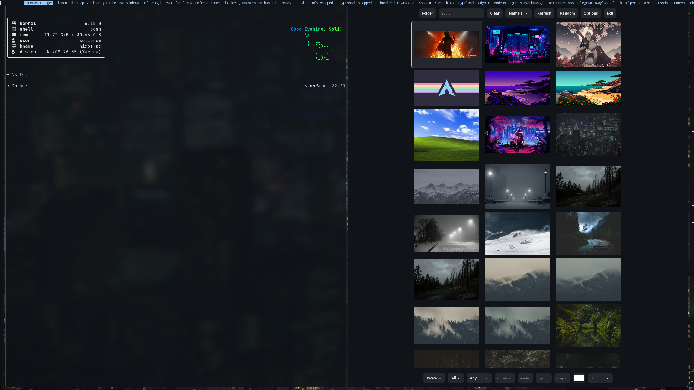
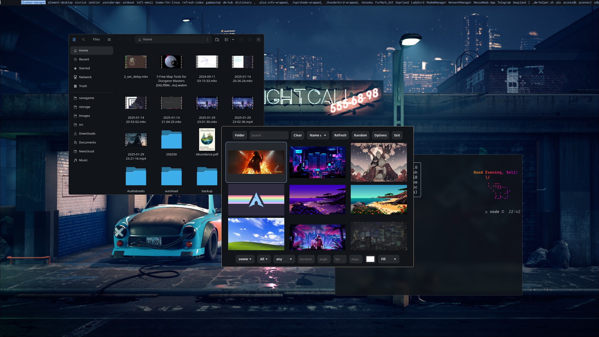

# NixOS Configuration

My modular, Wayland-based config flake for NixOS, using hjem. It's my personal
config, and not a configuration framework, so take things with a grain of salt.

## Features

- **Multi-host**: Laptop and desktop configs
- **Wayland**: Mango (default), Hyprland, Niri compositors
- **Dynamic theming**: Matugen for Material Design colors from wallpapers, and
  Darkman for automatic light/dark theming based on the time
- **Modern shell**: Nushell with Starship, Zoxide, Atuin
- **Dotfiles**: Managed with Hjem
- **Secrets**: Encrypted with agenix (WIP)

## Gallery
<details><summary>Gallery</summary>





</details>

## Quick Start

```bash
# Clone
git clone https://github.com/soliprem/nixos-config ~/.config/nix-config
cd ~/.config/nix-config
```

Before going forward, you should **modify the username**. It appears in a few
different files.

```bash
grep -r "soliprem" .
# or, if you have ripgrep
rg soliprem
```

Will provide you a list of all its mentions

```bash
# Build (choose your host)
sudo nixos-rebuild switch --flake .#nixos-laptop
# or
sudo nixos-rebuild switch --flake .#nixos-pc

# Or use nh (after first build)
nh os switch
```

## Structure

```
hosts/     # Host configs (laptop/pc/shared)
system/    # System modules and packages
hjem/      # User dotfiles
export/    # Standalone nvf configs
secrets/   # Encrypted secrets
```

## Key Components

- **Desktop**: Mango (default) · Hyprland · Ghostty · Zen Browser · Nautilus ·
  Tofi/Fuzzel · SwayNC · Caelestia Shell

- **Editors**: Neovim (nvf) · Helix · Emacs (unconfigured)

- **Development**: Git/Lazygit · Jujutsu · Docker · Language servers

- **AI**: Ollama (ROCm on desktop) · Open WebUI · Avante.nvim

- **Gaming**: Steam · Lutris · Heroic · Gamescope · GameMode

- **Media**: MPV · Spotify (Spicetify) · FreeTube · Tauon

## Theming

Set wallpaper and generate theme:

```bash
nixrice  # Interactive picker
# or
wallpaper-to-rice-nix /path/to/wallpaper.png
```

## Mango Shortcuts

- `SUPER + Return` - Terminal
- `SUPER + D` - Launcher
- `SUPER + W` - Browser
- `SUPER + Q` - Close window
- `SUPER + 1-9` - Workspaces

_(Hyprland has similar bindings when using that session)_

## Standalone Neovim (using nvf)

```bash
nix build .#nvf          # Full config
nix build .#nvf-minimal  # Minimal config
```

## Credits

Massive thanks to [NotAShelf](https://github.com/notashelf) for answering many
of my dumb questions.

## License

GNU General Public License v3.0 - See [LICENSE](LICENSE)
