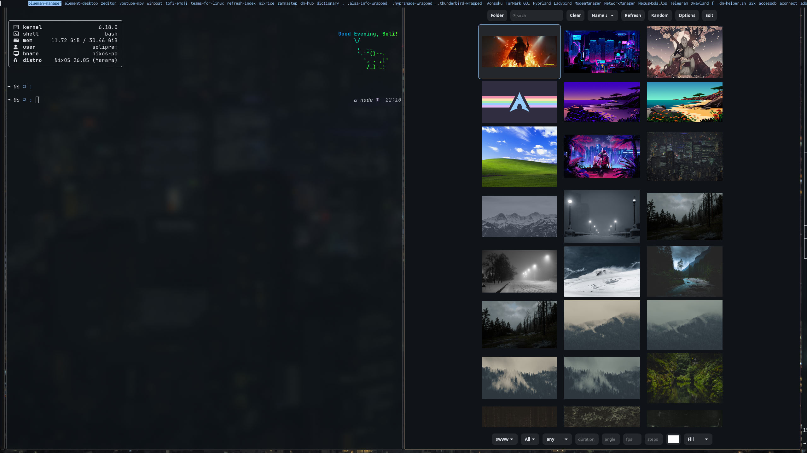
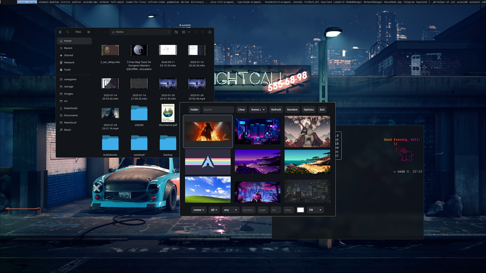

# NixOS Configuration

My modular, Wayland-based config flake for NixOS, using hjem. It's my personal
config, and not a configuration framework, so take things with a grain of salt.

I'm Unix-y and I like Nix, because it provides strong safeguards around a
unix-philosophy driven system. Since builds are reproducible, all parts of the
pipelines in any machine are configured correctly (or at least identically
wrong), meaning there's a lot less "random" bugs that come from small
inconsistencies, and that the system is generally more robust.

## Features

- Laptop and desktop configs
- Mango, Hyprland, Niri compositors
- Matugen for Material Design colors from wallpapers, and a utility script to
  flip polarity
- Nushell/Fish with Starship, Zoxide, Atuin
- Dotfiles managed with Hjem
- Secrets encrypted with agenix
- Standalone Neovim builds with nvf
- Ollama, with ROCm on the desktop config
- Flatpak, Steam, Spicetify, Open WebUI, printing, VPN, and a ReGreet greeter
- Rust and Julia flake templates

## Gallery

<details><summary>Gallery</summary>





</details>

## Quick Start

```bash
# Clone
git clone https://github.com/soliprem/nixos-config ~/.config/nix-config
cd ~/.config/nix-config
```

Before going forward, you should **modify the username**. It appears in a few
different files. Host names, hardware configs, monitor names, paths, and secrets
are also mine, so you probably want to check those too.

```bash
grep -r "soliprem" .
# or, if you have ripgrep (it do be nice)
rg soliprem
```

Will provide you a list of all its mentions

Before building a configuration, **change the hardware-configuration.nix to your
own**. You can find it in `/etc/nixos/hardware-configuration.nix`

```bash
# Build (choose your host)
sudo nixos-rebuild switch --flake .#nixos-laptop
# or
sudo nixos-rebuild switch --flake .#nixos-pc

# Or use nh (after first build)
nh os switch
```

## Flake Outputs

Beyond the host builds, the flake exposes a few outputs:

- `packages.x86_64-linux.nvf` - Full standalone Neovim config
- `packages.x86_64-linux.nvf-minimal` - Minimal standalone Neovim config
- `templates.rust` and `templates.julia` - Project templates

## Structure

```
hosts/             # Host configs (laptop/pc/shared)
system/            # System modules, packages, services, scripts, fonts
hjem/              # User dotfiles
export/            # Standalone nvf configs
flake-templates/   # Flake templates
assets/            # Screenshots, wallpapers, certs, wlogout assets
secrets/           # Encrypted secrets
```

## Hosts

- **nixos-laptop**: laptop hardware config, TLP, normal Ollama, iio-niri
- **nixos-pc**: desktop hardware config, latest kernel, AMDGPU bits, Ollama ROCm

Both hosts use the shared desktop setup in `hosts/shared/desktop.nix`, and the
shared base system in `hosts/shared/default.nix`.

## Key Components

- **Desktop**: Mango, Hyprland, Niri, Ghostty/Foot, Zen Browser, Nautilus,
  Tofi/Fuzzel, Quickshell, wlogout, swaylock
- **Editor**: Neovim (nvf)
- **Fun Stuff**: Audacity, Musescore Ollama (ROCm on desktop), Open WebUI
- **Media**: MPV, Spotify (Spicetify), Tauon

## Theming

Set wallpaper and generate theme:

```bash
nixrice  # Interactive picker
# or
nixrice /path/to/wallpaper.png
```

`nixrice` writes the selected wallpaper path to `~/.cache/bgpath`, runs matugen
using the current light/dark preference, and refreshes `assets/bg`.

Change the matugen scheme type that `nixrice` uses:

```bash
color-mode                # open a fuzzel picker and apply the selected type
color-mode current        # print the current saved type
color-mode list           # show supported scheme types
color-mode scheme-neutral # set a specific type
color-mode toggle         # quick toggle scheme-expressive <-> scheme-vibrant
```

Flip light/dark polarity:

```bash
toggle-polarity
toggle-polarity dark
toggle-polarity light
```

## Shortcuts

- `SUPER + Return` - Terminal
- `SUPER + D` - Launcher
- `SUPER + Shift + D` - Binary launcher
- `SUPER + W` - Browser
- `SUPER + Q` - Close window
- `SUPER + 1-9` - Workspaces
- `SUPER + Shift + 1-9` - Move window to workspace
- `SUPER + E` - File manager
- `SUPER + V` - Clipboard menu
- `SUPER + P` - Screenshot picker
- `SUPER + Alt + L` - Lock screen

_(Most compositors have similar bindings when using that session)_

## Standalone Neovim (using nvf)

```bash
nix build .#nvf          # Full config
nix build .#nvf-minimal  # Minimal config
```

## Templates

```bash
nix flake init -t t#rust
nix flake init -t t#julia
```

You can also obviously pull them as

```nix
nix flake init -t github:soliprem/nix-config#rust
nix flake init -t github:soliprem/nix-config#julia
```

## Secrets

Secrets are defined in `secrets/secrets.nix` and deployed through agenix. The
active system module is `system/modules/agenix.nix`.

Edit an existing secret with:

```bash
agenix -e secrets/<filename>.age
```

`bw-export-session` uses those secrets to log in to and unlock the Bitwarden CLI
when possible.

## Credits

Massive thanks to [NotAShelf](https://github.com/notashelf) for answering many
of my dumb questions.

## License

GNU General Public License v3.0 - See [LICENSE](LICENSE)
